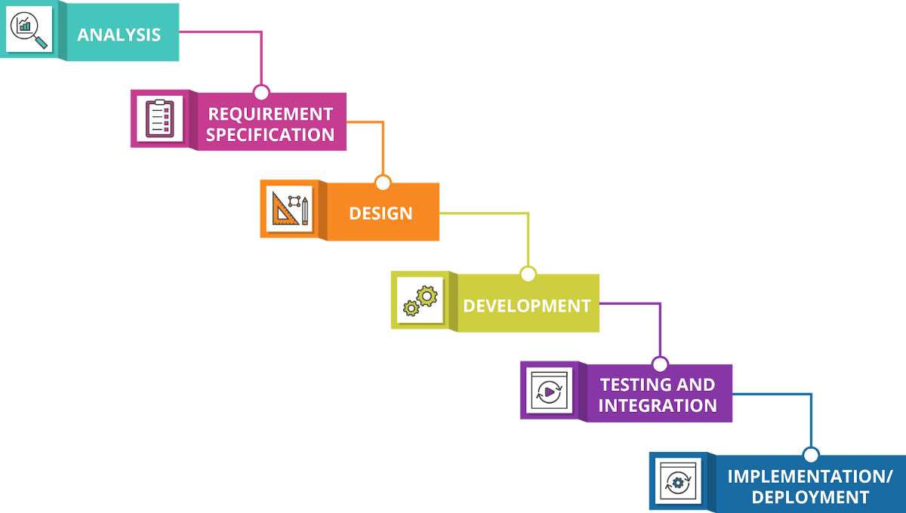
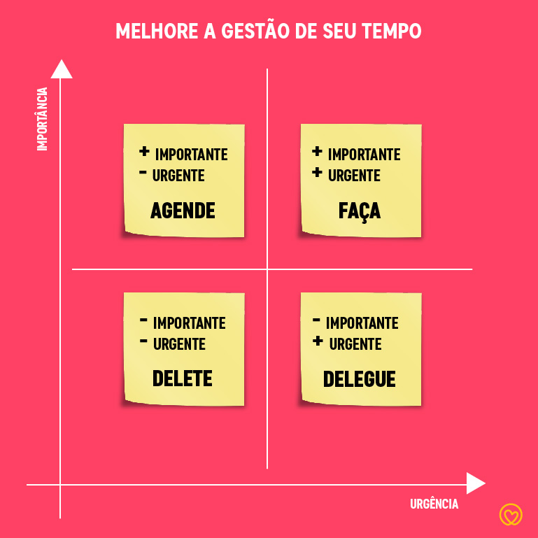

# Metodologias

## *Waterfall*

​	O Modelo *Waterfall*, ou Modelo em Cascata, é um modelo sequencial de desenvolvimento de *software*. Nele, o processo de criação de uma aplicação deve seguir um fluxo linear de etapas, fazendo com que sua representação diagramática se assemelhe, de fato, a uma cascata:

​	Por apresentar tal formato, o modelo traz entregas de valor muito distantes do início do processo - a etapa de análise, que fica no topo da cascata, encontra-se quatro processos atrás da etapa de *deploy*, que seria a última etapa de uma entrega.

### *Waterfall* x *Agile*

|                   | ***Waterfall***                                              | ***Agile***                                                  |
| ----------------- | ------------------------------------------------------------ | ------------------------------------------------------------ |
| **Imutabilidade** | Uma vez que o escopo de uma entrega é definida, ele torna-se imutável - caso haja alteração, todo o processo é reiniciado. | Apresenta caráter de alta mutabilidade, propondo a realização de várias pequenas entregas de valor ao longo do projeto no lugar de uma grande entrega ao final do mesmo. |
| **Expectativas**  | As expectativas de uma entrega *waterfall* são muito maiores, já que não são realizadas apresentações do processo de desenvolvimento desde o início do mesmo - a demora cria uma ideia mística de algo que deve ser concreto e prático. | Por se tratar de entregas menores e extremamente transparentes, as expectativas criadas são mais factíveis: se é alinhado que no dia X será entregue um novo botão de geração de um relatório, por exemplo, o cliente esperará que o botão somente gere o relatório de forma prática. |
| ***Feedbacks***   | Os *feedbacks* "cliente - equipe de desenvolvimento" demoram para aparecer, sendo apresentados, no geral, somente no final da cascata. | Os *feedbacks* são constantes - a cada pequena entrega, um *feedback* é retornado, facilitando e acelerando o processo de readaptações necessárias para a maximização do desempenho. |

## *Agile*

​	Ser ágil, no contexto da tecnologia da informação, é entregar mais valor mais rapidamente - não focando em velocidade em si, mas sim em entregas pequenas (que acabam reduzindo sim o tempo entre as entregas) e com alto nível de adaptabilidade.

### Priorização

​	Priorizar, de acordo com o dicionário [Dicio](https://www.dicio.com.br/), significa "garantir a prioridade ou a vantagem em relação a algo ou alguém" - ou seja, escolher um entre vários "itens" e focar primariamente nele. No contexto de desenvolvimento de *software*, priorizar geralmente consiste em colocar determinada tarefa acima de outras.

​	Por exemplo: caso um sistema que já esteja em produção pare de funcionar durante a madrugada, é quase certo que fazê-lo voltar às atividades normais será a maior prioridade do time responsável pela sua manutenção.

#### Matriz de *Eisenhower*

​	Uma forma de pensar em priorização é utilizando a Matriz de *Eisenhower*, que considera dois quesitos para a definição das mesmas: importância e urgência, que representam o resultado trazido pela tarefa e o prazo disponível para a tarefa, respectivamente.

​	No modelo, forma-se uma matriz com quatro células, cada uma com uma intersecção dos quesitos definidos por *Eisenhower* e com uma ação para as mesmas, onde:

1. **Faça:** se a tarefa possui muita importância e muita urgência, deve-se fazê-la na primeira oportunidade que tiver;
2. **Agende:** se a tarefa possui muita importância, mas pouca urgência, deve-se agendá-la para mantê-la no radar e dar uma data para que ela seja executada;
3. **Delegue:** se a tarefa possui pouca importância, mas muita urgência, deve-se delegá-la para outra pessoa realizá-la na primeira oportunidade que tiver;
4. **Delete:** se a tarefa não possui importância, nem urgência, ela pode ser removida de seu mapeamento.

### Fluxo

​	Quando utiliza-se de metodologias ágeis, o fluxo é definido para a realização das atividades de forma mais responsiva, após suas devidas priorizações. Ele pode ser definido por etapas ou finalidades, desde que respeite o processo ágil.

​	Ao construir uma nova casa, por exemplo, alguns cômodos são essenciais para que uma pessoa more na mesma (nesse caso, serão considerados um quarto e um banheiro). No Modelo em Cascata, seria desenhada uma planta de toda a casa, atrasando o desenvolvimento dos cômodos essenciais até que os outros também fossem finalizados - em uma metodologia ágil, seriam desenhadas somente as plantas do quarto e do banheiro e, então, quando ambos estivessem completamente finalizados (entregues, para que o cliente pudesse morar no prédio), seria iniciado o processo de desenho do resto da casa.

### *Feedbacks*

​	*Feedback*, de acordo com o dicionário [Merriam-Webster](https://www.merriam-webster.com/), significa "a transmissão de informação avaliativa ou corretiva sobre uma ação, evento ou processo para a fonte controladora ou original" (em tradução livre). Ou seja, uma avaliação de uma parte sobre algo realizado por outra, podendo ser dado para qualquer "tipo" de entidade (uma pessoa ou uma organização, por exemplo).

​	Seguindo o exemplo dado no item anterior, um possível *feedback* seria de que, após a entrega do banheiro, o novo morador percebeu que o caimento do piso para o ralo ficou desnivelado e a água fica acumulada em cantos da parte presente logo abaixo do chuveiro. Nesse caso, um ajuste deveria ser feito e, graças ao uso de uma metodologia ágil (altamente adaptável), será entregue com foco total antes de iniciar um processo menos importante.

